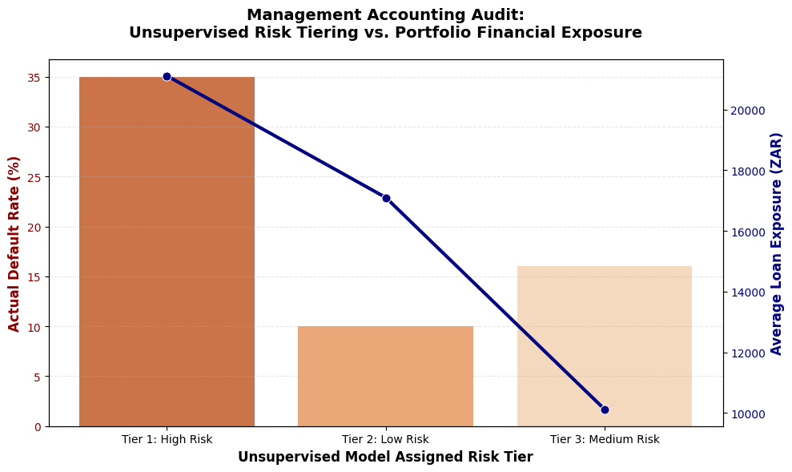
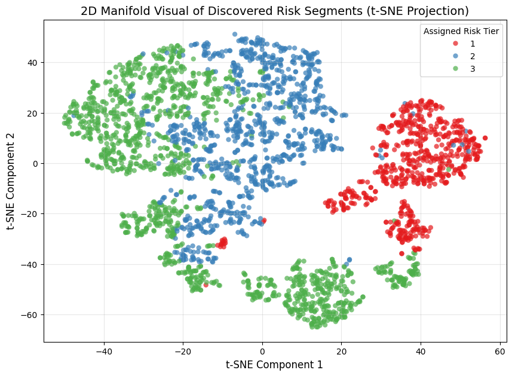
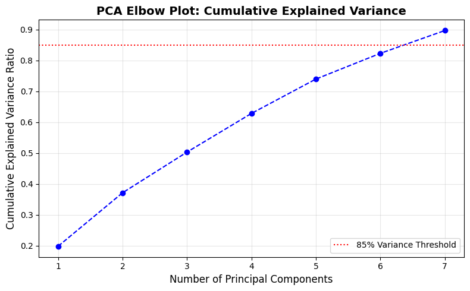

# Unsupervised Learning: Credit Risk Segmentation for Portfolio Capital Optimisation
Applying Principal Component Analysis and Agglomerative Hierarchical Clustering to segment borrowers based on credit standing and financial behaviour with the goal of reducing client portfolio risk.

## 🎯 Problem Statement
Traditional lending frameworks depend heavily on linear, rule-based scoring. This structural approach overlooks multi-variable factors that determines the level of risk related to a client - like applicants with stable credit scores who simultaneously seek maximum credit while having a high debt-to-income (DTI) metrics. This blind spot results in high default/delinquency concentration, costing lenders capital, that be prevented/saved by segmenting borrowers based on their layered financial behaviour.

---

## ⚙️ Data Pipeline
1. **Data Ingestion:** Streamed core risk features (`loan_amnt`, `term`, `int_rate`, `annual_inc`, `dti`, `fico_range_high`, `delinq_2yrs`, `open_acc`, `pub_rec`) while dropping transaction metrics to completely eliminate data leakage.
2. **Dimensionality Reduction (PCA) and Hierarchical Clustering:** Compressed the standardized feature space down to an orthogonal matrix capturing **85%+ total variance**, lowering computational time, load and model latency. Prepared the dataset for hierarchical clustering steps.
3. **Validation:** Projected the high-dimensional clusters onto a 2D t-SNE manifold and added a management accounting visual that depicts risk related financial metrics per customer tier.

---

## 📊 Portfolio Risk Matrix

The pipeline segmented a testing sub-pool of 3,000 completed loans into three distinct asset-risk classifications:

| Strategic Risk Indicator | Tier 2 (Low Risk) | Tier 3 (Medium Risk) | Tier 1 (High Risk) |
| :--- | :--- | :--- | :--- |
| **Borrower Count (N)** | 985 | 1,378 | 637 |
| **Average FICO Score** | **717.54** | 688.43 | 698.25 |
| **Average Interest Rate** | **9.66%** | 11.97% | 16.03% |
| **Average Loan Amount** | R17,100.53 | **R10,119.05** | **R21,112.68** |
| **Actual Default Rate** | **10.0%** | **16.0%** | **35.0%** |
| **Debt to Income Ratio** | **19.04** | **18.77** | **20.62** |

*\*Note: **Average Loan Amount** has been localised to ZAR for easier portfolio analysis.*

---

## 🖼️ Systems & Portfolio Visualizations

### 1. Management Accounting Portfolio Audit
Our customer behaviour audit reveals a credit allowance flaw: the institution has historically granted its largest loan sizes to the highest risk segment (Tier 1).

  

*Figure 1: Dual axis visual depicting the Delinquency Rate Percentage of a customer segment against its Average Loan Exposure.*

### 2. 2D Risk Manifold Projection (t-SNE)
Visualizing the continuous behavioral spectrum of borrower risk and segmentation based the historic financial behaviour.

  

*Figure 2: Non-linear t-SNE projection validating the distinct physical separation of our 3 macro risk tiers.*

### 3. PCA Cumulative Variance Elbow
Validating the threshold dimensions (dataset columns) need to to explain away the customer segmentation and behaviour.

  

*Figure 3: Cumulative variance distribution proving that feature engineering successfully condensed the multi-variable credit space down to core principal components.*

---

## 💡 Business Insights

### 1. The Toxic Exposure Loop in Tier 1
Tier 1 highlights a critical granting capital to customers. The lending engine correctly identified risk by charging this group a high average interest rate (~16%). However historically, the system simultaneously approved them for the **largest average capital exposure (R21,112.68)**. This compounding alignment of maximum exposure and high risk creates a debt cycle trap for the customers in the segment, resulting in a **35.0% actual default rate**.

### 2. The Mechanics of Exposure Capping in Tier 3
Although these retail borrowers carry the lowest average credit scores (688.43) and higher structural debt burdens, their default rate remains controlled at 16.0%. Management accounting confirms this is due to **Exposure Capping**: limiting their principal sizes to an average of R10,119.05 maintains debt sustainability and mitigates systemic balance sheet damage.

### 3. Optimal Credit Allowance and Repayment Committment for Tier 2
Tier 2 highlights the segment with the highest credit score and lowest interest rate which justifies their average loan amount at **R17,100.53** - with a 10% delinquency rate, this segment has access to high capital amounts as it settles its debt succesfully. 

---

## 🚀 Strategic Credit Policy Recommendations

* **Enforce Algorithmic Exposure Ceilings:** Automatically limit capital deployment to a hard ceiling of R12,000 for any new applicant landing within the Tier 1 geometric feature space. This single operational pivot immunizes the bank from the 35% default velocity bracket.
* **Scale Tier 2 Asset Allocation:** Redirect customer acquisition spend toward the Tier 2 profile. This cluster provides optimal asset-liability performance, supporting large capital generation capabilities (R17,100.53) alongside a stable 10% default floor.
* **Dynamic Regulatory Provisioning:** Transition from a flat portfolio reserve model to dynamic capital allocation. Lowering mandatory loss provisions on the highly predictable Tier 2 and Tier 3 blocks unlocks millions in frozen cash, converting idle capital back into active lending assets.

**NOTE:** The aim of this project was to practically implement Unsupervised Learning theory within the field of Fraud and Banking, effectively investigate and communicate a problem and solution and lastly to continue my Machine Learning expertise development.
